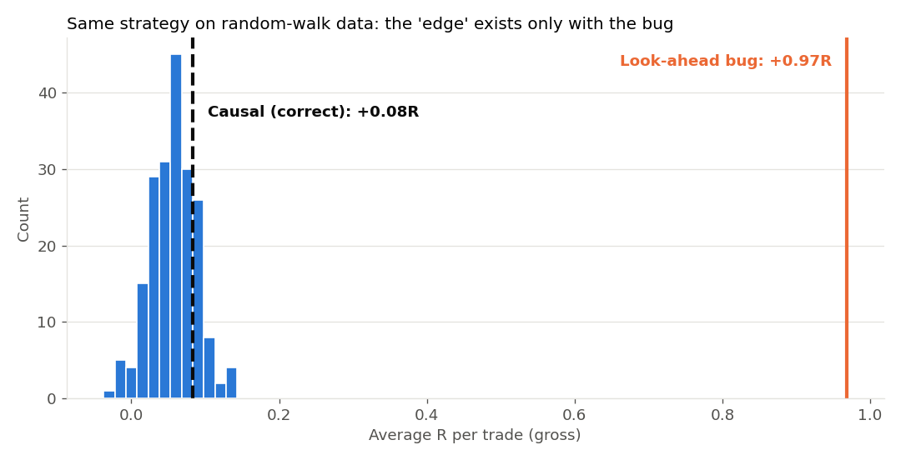
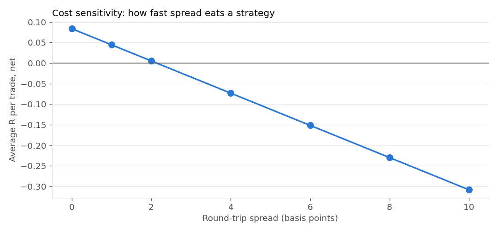
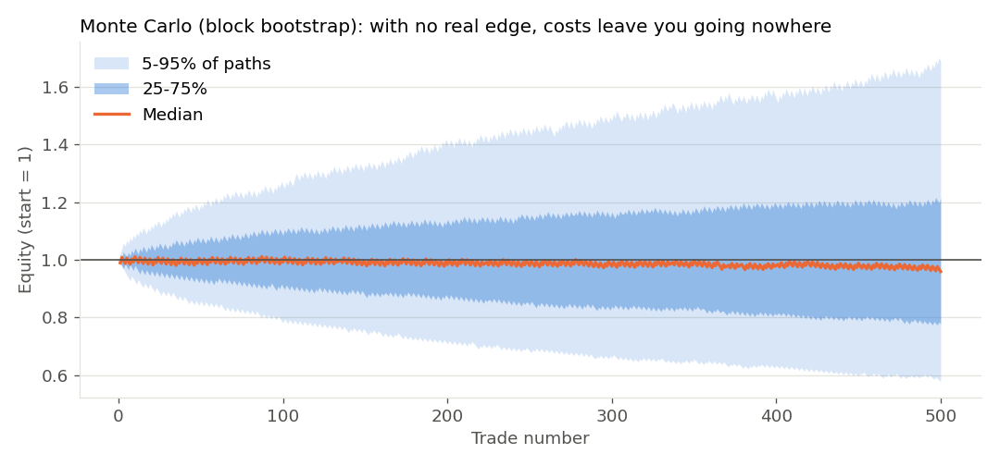

# backtest-audit-toolkit

**Is your trading backtest real, or a coding bug?**

A small, readable Python toolkit that runs the four checks I use on every strategy before trusting it:

1. **Look-ahead bias:** does the code use information it couldn't have had at the time?
2. **Realistic execution:** signal at the close, fill at the *next* bar's open, stop checked before target.
3. **Costs:** spread, commission and square-root market-impact slippage.
4. **Statistical validation:** comparison against random entries with identical rules, a t-test, and Monte Carlo (block bootstrap) paths.

## The demo: a fake edge on data that has no edge

`examples/demo.py` builds 30,000 hourly bars of a **driftless random walk**. By construction no strategy can have a real edge on it. Then it tests a common retail rule, *"buy after a swing low"*, twice: once with a classic look-ahead bug and once written correctly.

| Version | Trades | Avg R (gross) | Win rate | vs 200 random-entry backtests |
|---|---|---|---|---|
| Look-ahead bug | 1,927 | **+0.97R** | 65.6% | beats 100% (t = +28) |
| Causal (correct) | 2,143 | +0.08R | 36.1% | beats 81% (t = +0.8, not significant) |
| Random entries (mean) | | +0.06R | | |

The bug marks a swing low at bar *p*, but a swing low can only be confirmed after the next *k* bars close. So the buggy backtest "buys" at the exact bottom and looks spectacular. Written correctly, the same rule is indistinguishable from random.



### Costs decide everything near zero

Even the causal version's tiny gross number disappears at about 2 basis points of round-trip spread:



### Monte Carlo: a range, not a single equity curve

Block-bootstrapped trade sequences (2,000 paths, 1% risk per trade). With no real edge, costs leave you going nowhere, and the spread of outcomes shows how easy it is to mistake luck for skill on one backtest:



## Methods

| Module | What it does |
|---|---|
| `audit/data.py` | Synthetic random-walk OHLC (an honest test bench: real edge = 0) |
| `audit/signals.py` | Swing-point signals in buggy and causal form |
| `audit/engine.py` | Next-open fills, worst-case intrabar stop handling, R-multiples |
| `audit/costs.py` | `slip = ½·spread + k·σ·√(order / ADV)` and cost in R |
| `audit/baseline.py` | Random-entry control with the same count, stop and exit rules |
| `audit/stats.py` | t-test vs baseline, permutation percentile, block bootstrap |

The tests prove the key property directly: **changing a future bar must never change a past signal.** The causal signal passes; the buggy one fails (`tests/test_audit.py`).

## Run it

```bash
pip install -r requirements.txt
python examples/demo.py     # prints the table and writes the charts to docs/
pytest -q                   # 6 tests
```

## Use it on your own strategy

Replace the signal function with your own rule (it just returns a boolean array, one value per bar), load your OHLC data into a DataFrame with `open, high, low, close` columns, and run the same engine, baseline and stats.

---

Built by **Sahil T.**, trading software developer (MT4/MT5, MQL5, Python). I build Expert Advisors and prop-firm risk managers, and audit backtests for look-ahead bias and real costs.

*This is software for testing strategies. It is not financial advice and makes no profit claims.*

**License:** All rights reserved. Published for viewing and evaluation only; see [LICENSE](LICENSE). For custom work or licensing, contact me via Upwork or Fiverr.
